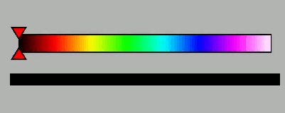
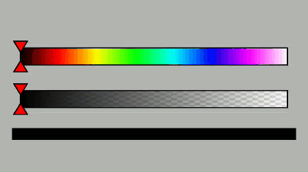

# TPColorSelectionSeekBar [](https://jitpack.io/#Tim1802/TPColorSelectionSeekBar)

<span>
    
    
    
</span>

# Download
Make sure that you have added the JitPack repository to your root build.gradle file:

```gradle
allprojects {
    repositories {
      //All your other repositories ...
      
      maven { url 'https://jitpack.io' }
   }
}
```

Add the dependency:

```gradle
dependencies {
    //All your other dependencies ...
    
    implementation 'com.github.Tim1802:TPColorSelectionSeekBar:v3.5.0'
}
```
# Usage
XML:
```xml
<de.tpohrer.tpcolorselectionseekbar.TPColorSelectionSeekBar
    android:id="@+id/colorBar"
    android:layout_width="match_parent"
    android:layout_height="wrap_content"/>
```
Attributes:
| Attribute                                            | Description                             | Default value(s)  |
| -------------                                        |:-------------:                          | :-----:|
| app:colorBarCornerRadius="8dp"                       | Corner radius of the bar(s)             | 0px |
| app:colorBarHeight="16dp"                            | Height of the bar(s)                    | 60px |
| app:colorBarBorderColor="@color/barBorderColor"      | Border color of the bar(s)              | #000000 |
| app:colorBarColors="@array/barColors"                | Colors to be displayed in the bar       | #000000, #FF0000, #FFFF00, #00FF00, #00FFFF, #0000FF, #FF00FF, #FFFFFF |
| app:thumbBorderColor="@color/thumbBorderColor"       | Border color of the thumbnail           | #000000 |
| app:thumbFillColor="@color/thumbFillColor"           | Fill color of the thumbnail             | #FF0000 |
| app:showAlphaBar="true"                              | Possibility to select alpha value       | false   |
| app:isVertical="true"                                | Possibility to display vertical bar(s)  | false   |


Listener for color change:
```kotlin
colorBar.setColorSelectionChangedListener { color, viewId ->
    //TODO: do something with the new color   
}

--- or ---

private fun colorChangedListener (color: Int, viewId : Int) { 
    //TODO: do something with the new color   
}

colorBar.setColorSelectionChangedListener(::colorChangedListener)

```
<b>Check out the sample project if you need help or get stuck!</b>

# What's next?

| Version        | Feature(s)                             | Status                             |
| :-------------:|:---------------------------------:     | :---------------------------------:|
| 2.0.0          | Possibility to select alpha value      | Done                               | 
| 3.0.0          | Possibility to display vertical bar(s) | Done                               | 
| 3.1.0          | Support gravity                        | Done                               | 
| 3.2.0          | Smaller fixes                          | Done                               | 
| 3.3.0          | Replace interface callback with lambda | Done                               | 
| 3.4.0          | Update to latest Kotlin version        | Done                               |
| 3.5.0          | Fix display of color bar               | Done                               |


# Licence
```
Copyright 2020 Tim Pohrer

Licensed under the Apache License, Version 2.0 (the "License");
you may not use this file except in compliance with the License.
You may obtain a copy of the License at

   http://www.apache.org/licenses/LICENSE-2.0

Unless required by applicable law or agreed to in writing, software
distributed under the License is distributed on an "AS IS" BASIS,
WITHOUT WARRANTIES OR CONDITIONS OF ANY KIND, either express or implied.
See the License for the specific language governing permissions and
limitations under the License.
```
</br>

<p align="center">
  <b>Thank you for using my library!</b></br></br>
  Found a bug or missing a feature?</br>
  Feel free to open an issue or create a pull-request
</p>
